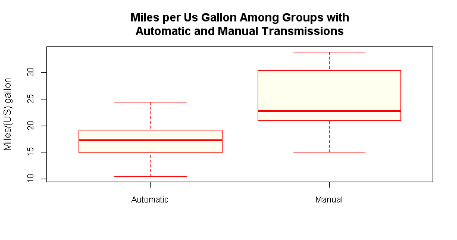

# Which Cars are Better in Terms of Miles per US Gallon?
Angelo Peñaloza Salazar  
November 20, 2015  

**1. Executive Summary.**
This document describes an analysis made of the mtcars dataset attempting to discover if an automatic or manual transmission is better for cars in terms of miles per US gallon and quantifying the difference between both types of transmissions. To achieve these goals a ***multivariate regression model*** was used and through its development the ***forward selection method*** was applied prioritizing the ***adjusted R squared criterion*** over p-values.

**2. Exploratory Data Analysis.**
The relation between the miles per US gallon and the type of transmissions in cars is shown in figure 1 and can be described as follows: In general cars with manual transmission can make more miles per US gallon than cars with automatic transmission as can be seen by the higher values of the median and all quartiles.  

Additionally, Figure 2 shows through multiple scatter plots the relationship between the 11 variables contained in the mtcars dataset. The highest correlation is 0.902 between variables "cyl" and "disp"; while the lowest one is 0.0575 between "am" and "carb". Nevertheless, a better look to the dataset shows that some of this variables should be treated as categorical rather than numerical.

Concretely, variables "cyl", "vs", "am" and "gear" were converted to factors which is the appropriate class for categorical variables and levels were renamed. Variable "carb" could have been also treated as categorical, but in this case I decided to keep it as numerical since its range is larger and its correlation with the regresor of interest "am" is the lowest on the dataset.

**3. Fitting Models and Strategy for Model Selection.**

The starting point for model selection was to to create a simple model using as the only regressor the variable of interest, which according to the questions initially formulated is "am"; hence the initial model was:

$$mpg = \beta_0 + \beta_1 ammanual$$

After that, several models were fitted using as a strategy the ***forward selection method*** in which we add predictors to the initial model one at a time and pick the model with the highest adjusted R squared, creating a new model with two predictors, then we repeat the process until the addition of any of the other remaining variables does not result in a higher adjusted R squared.

The criteria of using the adjusted R squared to select the final model is because of two reasons:
1) Unadjusted R squared always increases as more regressors are added to the model, favoring overfitting which makes the model less acurate to unseen new data.
2) The adjusted R squared theoretically can lead as to a model with more reliable predictors than a model only based on p-values since the last one depends on the subjective criterion of choosing a significance level.

Table 1 contains all the succesive steps taken, showing the adjusted R squared obtained by adding variables one by one to the model created in a previous step.

**4. Final Model and Interpretation of Coefficients.**
The final model obtained was the one with the highest adjusted R squared value (0.8418) and is as follows:

$$mpg = 31.18 + 2.70ammanual - 0.03hp - 2.37wt - 2.09cyl6 + 0.29cyl8 + 1.99vsStraight engine$$

It is important to note that the intercept is using as ***reference levels***: "automatic" for variable "am", "cyl4" for variable "cyl" and "V engine" for variable "vs".

$\beta_0:$ The ***intercept*** shows that cars with automatic transmission, 4 cylinders and a V engine, no weight nor gross horsepower, are expected to perform on average 31.18 miles per US gallon.

$\beta_1:$ Cars with manual transmission perform on average 2.7 mpg more than cars with automatic transmission, remaining all the other variables constant.

$\beta_2:$ On average the model predicts that an increase of 1 horsepower will result in a decrease of 0.03 mpg, all else held constant. 

$\beta_3:$ On average the model predicts that an increase of 1000 lb. will result in a decrease of 2.37 mpg, considering everything else remains constant. 

$\beta_4:$ Cars with 6 cylinders perform on average 2.09 mpg less than cars with 4 cylinders, all else held constant.

$\beta_5:$ Cars with 8 cylinders perform on average 0.29 mpg more than cars with 4 cylinders, ceteris paribus.

$\beta_6:$ Cars with straight engine perform on average 1.99 mpg more than cars with v engine, keeping the rest of the variables constant.

A summary of the final model is presented in Table 2

**5. Residuals Plots and Diagnostics.**

The first plot from Figure 3 shows that residuals seem to be random around zero, with no particular trend or systematic pattern like heteroscedasticity. The second plot compares the standarized residuals with the theoretical quantiles and the tails from this plot suggest that residuals are not very likely to be normally distributed.

The 3rd plot shows standardized residuals (residuals divided by the standard deviation) vs. fitted values with no specific pattern. Finally the 4th plot shows two leverage points which are possible outliers that fall horizontally away from the bulk of the data but don't influence the slope of the regression line. By using the hatvalues function we can see that the most extreme value is 0.4912 and corresponds to a Maserati Bora, while the 2nd leverage point belongs to a Porsche 914-2 with a value equal to 0.4556.

**6. Conclusions and Answers to the Questions of Interest.**

As it was stated in the anaysis unfolded, cars with manual transmission are better than cars with automatic transmission in terms of miles driven per US Gallon. This statement was quantified by the $\beta_1:$ coefficient which shows that on average cars with manual transmission perform 2.7 mpg more than cars with automatic transmission all else held constant. This was also supported by the boxplot presented in Figure 1.

The uncertainty of the model measured by the variability of the residuals was calculated on Table 2 and is equal to 2.397 mpg (remember that residuals are measured in the same units than the dependent variable). Aditionally, 15.82% of the total variability is not explained by the model; this is: 

% of Total Variability Not Explained By The Model = 1 - Adjusted $R^2$ = 1 - 0.8418 = 0.1582

Nevertheless, further analysis is needed since the scope for this project was mostly oriented to multivariate regression and several machine learning algorithms were not considered in class.


***APPENDIX MATERIAL***


 

**Figure 1:** The boxplot shows that in general cars with manual transmissions perform better than cars with automatic transmissions in terms of miles per US gallon. The median for cars with manual transmissions is 22.8 while the median for cars with automatic transmission is only 17.3


 

**Figure 2:** Multiple scatter plots of the 11 variables contained in the mtcars dataset.


**Table1: Summary of Forward Selection Method**


```
##     Step Variable_to_add Adjusted_Rsquared
## 1  step1              am         0.3384589
## 2  step2             cyl         0.7399447
## 3  step2            disp         0.7149405
## 4  step2              hp         0.7670025
## 5  step2            drat         0.4554386
## 6  step2              wt         0.7357889
## 7  step2            qsec         0.6652425
## 8  step2              vs         0.6644330
## 9  step2            gear         0.4395670
## 10 step2            carb         0.6832362
## 11 step3             cyl         0.7989306
## 12 step3            disp         0.7776925
## 13 step3            drat         0.7715509
## 14 step3              wt         0.8227357
## 15 step3            qsec         0.7654448
## 16 step3              vs         0.7847948
## 17 step3            gear         0.7621212
## 18 step3            carb         0.7746726
## 19 step4             cyl         0.8400875
## 20 step4            disp         0.8165613
## 21 step4            drat         0.8195618
## 22 step4            qsec         0.8367919
## 23 step4              vs         0.8277202
## 24 step4            gear         0.8101067
## 25 step4            carb         0.8216415
## 26 step5            disp         0.8343702
## 27 step5            drat         0.8339335
## 28 step5            qsec         0.8414477
## 29 step5              vs         0.8417804
## 30 step5            gear         0.8283221
## 31 step5            carb         0.8336910
## 32 step6            disp         0.8358640
## 33 step6            drat         0.8355668
## 34 step6            qsec         0.8379890
## 35 step6            gear         0.8321363
## 36 step6            carb         0.8362758
```

**Table2: Summary of the Final Model**


```
## 
## Call:
## lm(formula = mpg ~ am + hp + wt + cyl + vs, data = data1)
## 
## Residuals:
##     Min      1Q  Median      3Q     Max 
## -4.3405 -1.2158  0.0046  0.9389  4.6354 
## 
## Coefficients:
##                   Estimate Std. Error t value Pr(>|t|)    
## (Intercept)       31.18461    3.42002   9.118    2e-09 ***
## ammanual           2.70384    1.59850   1.691   0.1032    
## hp                -0.03475    0.01382  -2.515   0.0187 *  
## wt                -2.37337    0.88763  -2.674   0.0130 *  
## cyl6              -2.09011    1.62868  -1.283   0.2112    
## cyl8               0.29098    3.14270   0.093   0.9270    
## vsStraight engine  1.99000    1.76018   1.131   0.2690    
## ---
## Signif. codes:  0 '***' 0.001 '**' 0.01 '*' 0.05 '.' 0.1 ' ' 1
## 
## Residual standard error: 2.397 on 25 degrees of freedom
## Multiple R-squared:  0.8724,	Adjusted R-squared:  0.8418 
## F-statistic: 28.49 on 6 and 25 DF,  p-value: 5.064e-10
```

 

**Figure 3:** Residuals plots show that residuals seem to be randomly distributed with no particular systematic pattern or trend. However, the tails on the Q-Q plot suggest they are not perfectly normal. Finally, on the 4th plot two leverage points were detected.  


